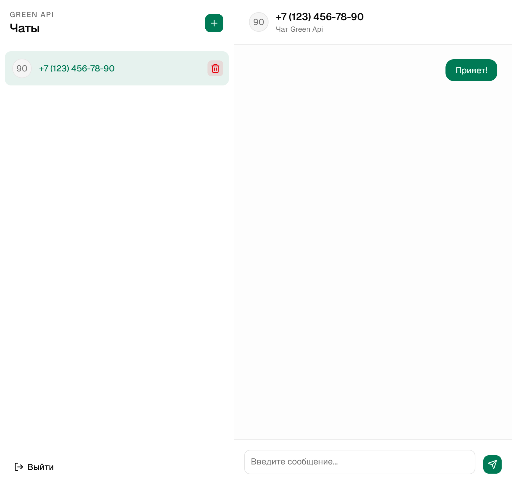

# Green API Demo Chat

[Открыть демо](https://vadim-sartakov.github.io/green-api/)

Демонстрационное чат-приложение на базе Green API. Пользователь вводит данные инстанса, создает чат по номеру телефона, отправляет сообщения и получает входящие сообщения через long polling.



## Стек

- React 19 и TypeScript
- Vite
- Redux Toolkit и RTK Query
- Tailwind CSS и shadcn, Base UI
- React Hook Form и React IMask
- Vitest и Testing Library
- Oxlint и Oxfmt

## Рабочий процесс

1. Пользователь вводит `idInstance` и `apiTokenInstance`.
2. После входа можно создать чат по номеру телефона.
3. При отправке сообщения приложение проверяет аккаунт через Green API, затем отправляет сообщение.
4. Входящие уведомления постоянно запрашиваются через `receiveNotification`.
5. Полученное текстовое сообщение добавляется в чат, после чего уведомление удаляется из очереди.

## Скрипты

```bash
npm run dev               # локальный сервер разработки
npm run build             # проверка типов и production-сборка
npm run test              # unit и integration тесты
npm run test:unit         # unit, API и hook тесты
npm run test:integration  # интеграционный сценарий приложения
npm run lint              # проверка Oxlint
npm run fmt               # форматирование
npm run fmt:check         # проверка форматирования
```

Для другого адреса API можно задать переменную окружения `VITE_API_BASE_URL`.
